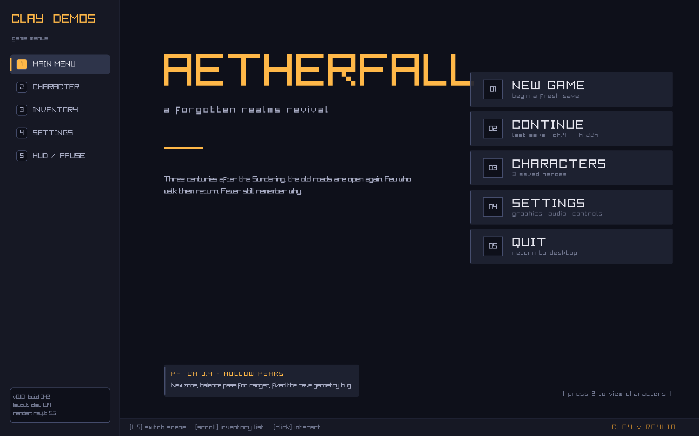
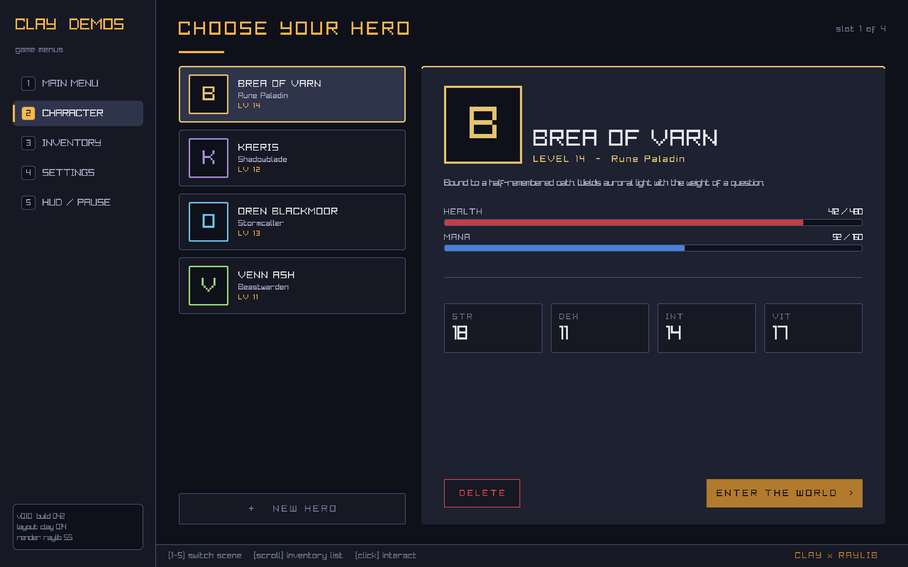
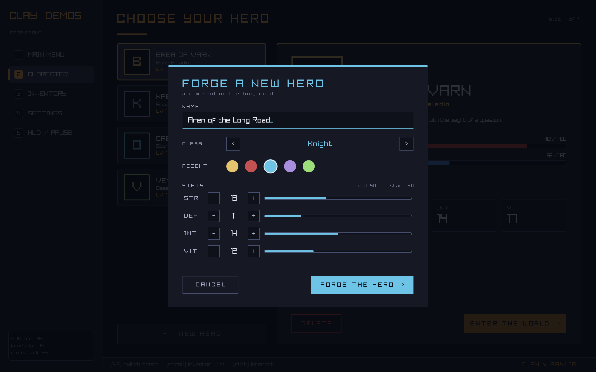
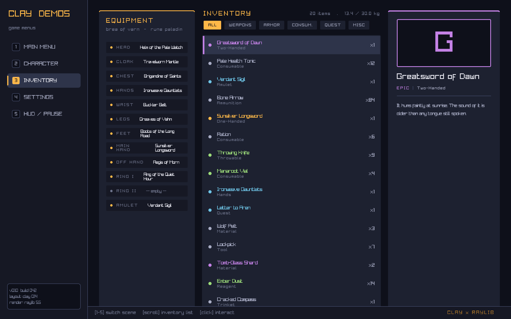
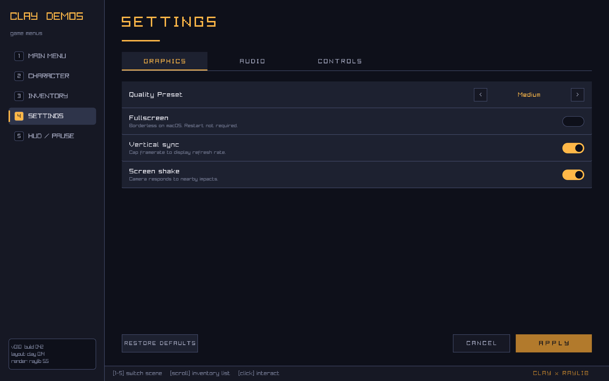
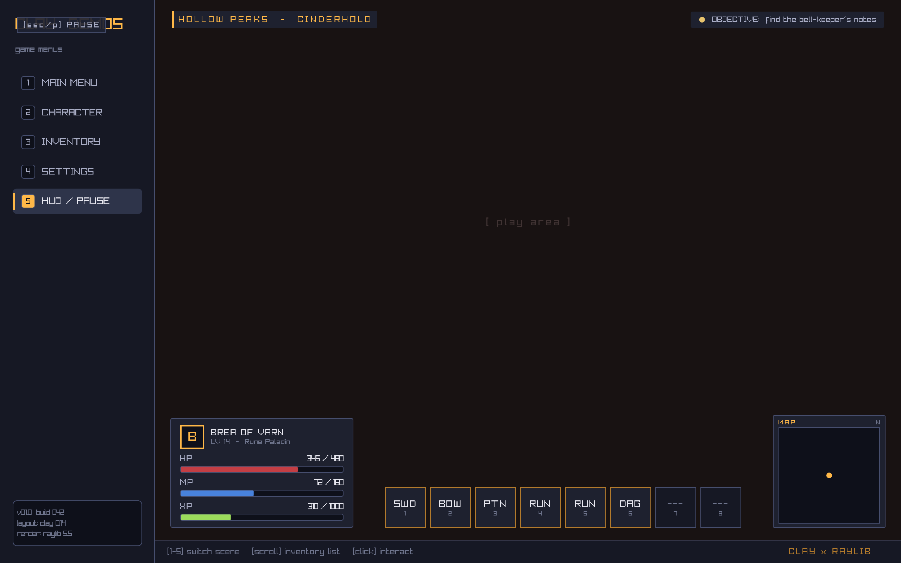

# Clay Game Menus

> A demo of [**Clay**](https://github.com/nicbarker/clay) — a tiny, declarative, flexbox-style layout library in C — building a complete set of interactive game menus on top of the official Raylib renderer.

<p align="center">
  
</p>

Five fully-interactive scenes plus a modal form, in a few hundred lines of layout code. Hover, click, scroll, text input, floating overlays, scroll containers, tabbed views — most of what Clay can do, in one app, with one shared style.

## Scenes

<table>
  <tr>
    <td width="50%"><strong>1. Main menu</strong><br/></td>
    <td width="50%"><strong>2. Character select</strong><br/></td>
  </tr>
  <tr>
    <td><strong>★ Forge a new hero (modal)</strong><br/></td>
    <td><strong>3. Inventory</strong><br/></td>
  </tr>
  <tr>
    <td><strong>4. Settings</strong><br/></td>
    <td><strong>5. HUD / pause</strong><br/></td>
  </tr>
</table>

| # | scene             | demonstrates |
|--:|-------------------|---|
| 1 | Main menu         | typography hierarchy, hover accent bars, info strips |
| 2 | Character select  | data-driven cards, click selection, stat bars per slot |
| 3 | Inventory         | scroll container, filter pills, rarity colour, equipment paper-doll |
| 4 | Settings          | tabbed sub-views, sliders, toggles, steppers, key-binding rows |
| 5 | HUD / pause       | layered HUD over a play space, floating pause overlay |
| ★ | Forge a new hero  | a modal form: text input, class stepper, accent swatches, stat allocator |

## Run

```bash
brew install raylib   # macOS, one-time
./run.sh
```

`run.sh` builds incrementally and execs the binary. Tested on macOS 14+ / Apple Silicon with Raylib 5.5.

## Controls

| | |
|---|---|
| `1`-`5` (or click the sidebar) | switch scene |
| **Click** | interact with anything that hovers |
| **Scroll** | scroll the inventory list |
| `ESC` / `P` on the HUD | toggle pause |
| `ESC` in the new-hero form | cancel |
| Typing | enters the hero name field when the form is open |

## How it's wired

Clay is a layout *engine*: you describe a tree of elements with `CLAY({...}) { ... }`, it computes a flat list of render commands, and any renderer can draw them. Here it's the bundled official Raylib renderer.

```c
Clay_BeginLayout();
CLAY(CLAY_ID("Root"), {
    .layout = { .sizing = { CLAY_SIZING_GROW(0), CLAY_SIZING_GROW(0) } },
}) {
    Sidebar(state);
    Scene(state);
}
Clay_RenderCommandArray cmds = Clay_EndLayout(GetFrameTime());

BeginDrawing();
    ClearBackground((Color){ 12, 12, 18, 255 });
    Clay_Raylib_Render(cmds, fonts);
EndDrawing();
```

Patterns worth a look:

- **Hover for free** — `Clay_Hovered()` inline inside an element's declaration switches background/border colours in the same expression that builds it.
- **Click handling** — `Clay_PointerOver(id) + IsMouseButtonPressed(...)` per scene; no global event router needed.
- **Scroll** — `.clip = { .vertical = true, .childOffset = Clay_GetScrollOffset() }` is all the inventory list needs.
- **Modals / overlays** — `.floating = { .attachTo = CLAY_ATTACH_TO_ROOT, .zIndex = 20 }` is how the pause overlay and the new-hero form layer above the rest of the screen.
- **Dynamic text** — a small per-frame string arena (`UI_Fmt`, `src/ui.c`) hands Clay text whose backing memory survives until the renderer reads it.

## Project layout

```
src/
  main.c       entry, scene dispatcher, raylib glue, screenshot mode
  ui.h / ui.c  palette, sidebar, footer, StatBar, frame string arena
  scenes.c     five scenes + the new-hero form

vendor/
  clay.h                   Clay 0.14 (single header)
  clay_renderer_raylib.c   official Clay Raylib backend

scripts/
  capture.sh               regenerate the screenshots in this README
```

## Reproducing the screenshots

The binary recognises three environment variables for non-interactive captures (no manual screenshotting needed):

| variable           | meaning |
|--------------------|---|
| `CLAY_SCREENSHOT`  | basename of the PNG to write; the app exits a few frames after writing |
| `CLAY_SCENE`       | start in scene `0`-`4` (main / character / inventory / settings / hud) |
| `CLAY_FORM=1`      | open the new-hero form (meaningful with `CLAY_SCENE=1`) |

```bash
CLAY_SCENE=1 CLAY_FORM=1 CLAY_SCREENSHOT=hero.png ./build/clay-menus
```

`scripts/capture.sh` regenerates everything in `docs/assets/` in one go.

## License

Clay and Raylib are both [Zlib](https://opensource.org/license/zlib)-licensed. The demo code is yours to copy.
